```python
from keras.preprocessing.image import ImageDataGenerator
from keras.layers import Convolution2D, MaxPooling2D
from keras.layers import Activation, Dropout, Flatten, Dense
from keras.models import Sequential
from keras.models import model_from_json
import matplotlib.pyplot as plt
import matplotlib
import brewer2mpl
import numpy as np
import pandas as pd

set3 = brewer2mpl.get_map('Set3', 'qualitative', 6).mpl_colors
%matplotlib inline
```

    Using Theano backend.


## Loading CNN Model


```python
# load json and create model
json_file = open('data/results/model.json','r')
loaded_model_json = json_file.read()
json_file.close()
model = model_from_json(loaded_model_json)
# load weights into model
model.load_weights('data/weights/model.h5')
```

## Data Summary

| FER2013 data | count|
|:-------------|-----:|
|Training      | 28709|
|Private Test  |  3589|
|Public Test   |  3589|

| Training set | count|
|:-------------|-----:|
|Angry         |  4431|
|Fear          |  4097|
|Happy         |  7215|
|Sad           |  4830|
|Surprise      |  3171|
|Neutral       |  4965|

## Model Accuracy


```python
# import public test:
#X_fname = 'data/X_publictest6_100pct.npy'
#y_fname = 'data/y_publictest6_100pct.npy'
X_fname = 'data/X_train_publictest6_100pct.npy'
y_fname = 'data/y_train_publictest6_100pct.npy'
#X_fname = 'data/X_train_md.npy'
#y_fname = 'data/y_train_md.npy'

X = np.load(X_fname)
y = np.load(y_fname)
print 'Public test set'
y_labels = [np.argmax(lst) for lst in y]
counts = np.bincount(y_labels)
labels = ['angry', 'fear', 'happy', 'sad', 'surprise', 'neutral']
print zip(labels, counts)
# evaluate model on public test set
model.compile(loss='categorical_crossentropy', optimizer='adam', metrics=['accuracy'])
score = model.evaluate(X, y, verbose=0)
print "model %s: %.2f%%" % (model.metrics_names[1], score[1]*100)
```

    Public test set
    [('angry', 523), ('fear', 496), ('happy', 895), ('sad', 653), ('surprise', 415), ('neutral', 607)]
    model acc: 57.34%


```python
# import private test:
X_fname = 'data/X_train_privatetest6_100pct.npy'
y_fname = 'data/y_train_privatetest6_100pct.npy'
X = np.load(X_fname)
y = np.load(y_fname)
print 'Private test set'
y_labels = [np.argmax(lst) for lst in y]
counts = np.bincount(y_labels)
labels = ['angry', 'fear', 'happy', 'sad', 'surprise', 'neutral']
print zip(labels, counts)
# evaluate model on private test set
model.compile(loss='categorical_crossentropy', optimizer='adam', metrics=['accuracy'])
score = model.evaluate(X, y, verbose=0)
print "model %s: %.2f%%" % (model.metrics_names[1], score[1]*100)
```

    Private test set
    [('angry', 546), ('fear', 528), ('happy', 879), ('sad', 594), ('surprise', 416), ('neutral', 626)]
    model acc: 58.07%


## Data Vizualization


```python
def overview(start, end, X):
    fig = plt.figure(figsize=(8,10))
    for i in range(start, end+1):
        input_img = X[i:(i+1),:,:,:]
        ax = fig.add_subplot(16,12,i+1)
        ax.imshow(input_img[0,0,:,:], cmap=matplotlib.cm.gray)
        plt.xticks(np.array([]))
        plt.yticks(np.array([]))
        plt.tight_layout()
    plt.show()
```


```python
overview(0,191, X) # overview of face data as thumbnails (private)
```


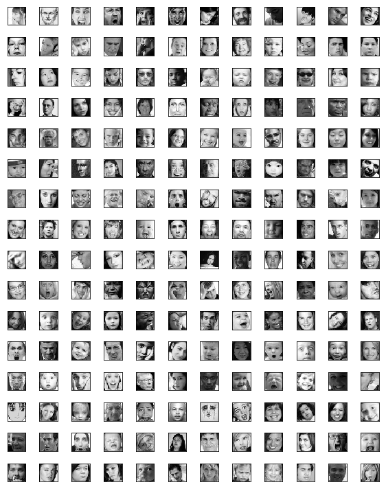


```python
def plot_filters(layer, x, y):
    filters = layer.W.get_value()
    fig = plt.figure(figsize=(8, 4))
    for j in range(len(filters)):
        ax = fig.add_subplot(y, x, j+1)
        ax.matshow(filters[j][0], cmap = matplotlib.cm.Blues)
        plt.xticks(np.array([]))
        plt.yticks(np.array([]))
    plt.tight_layout()
    return plt
```


```python
plot_filters(model.layers[0], 8, 4)
#plot_filters(model.layers[4], 8, 8)
#plot_filters(model.layers[10], 16, 8)
```


    <module 'matplotlib.pyplot' from '/home/umesh/anaconda2/envs/kerasenv/lib/python2.7/site-packages/matplotlib/pyplot.pyc'>


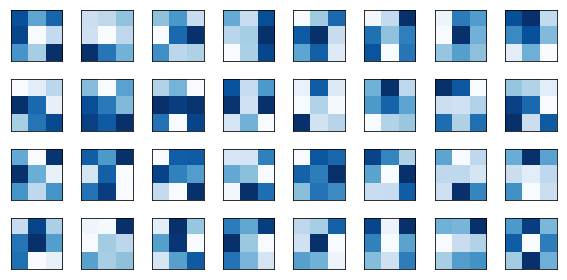


```python
input_img = X[0:1,:,:,:] # subject0
print input_img.shape
plt.imshow(input_img[0,0,:,:], cmap='gray')
```

    (1, 1, 48, 48)


    <matplotlib.image.AxesImage at 0x7fe2f796e090>


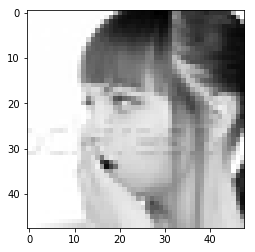


## Computer Vision


```python
import theano
def plot_interlayer_outputs(input_img, layer_num1, layer_num2, colormaps=False):
    output_fn = theano.function([model.layers[layer_num1].input], # import theano
                                 model.layers[layer_num2].output, allow_input_downcast=True)
    im = output_fn(input_img) #filtered image
    print im.shape
    n_filters = im.shape[1]
    fig = plt.figure(figsize=(12,6))
    for i in range(n_filters):
        ax = fig.add_subplot(n_filters/16,16,i+1)
        if colormaps:
            ax.imshow(im[0,i,:,:], cmap='Blues')#seq_colors[i]
        else:
            ax.imshow(im[0,i,:,:], cmap=matplotlib.cm.gray) #matplotlib.cm.gray
        plt.xticks(np.array([]))
        plt.yticks(np.array([]))
        plt.tight_layout()
    plt.show()
```


```python
plot_interlayer_outputs(input_img, 0, 1, colormaps=True)
# figsize=(12,6)
# ax = fig.add_subplot(n_filters/8,8,i+1)
```

    (1, 32, 48, 48)


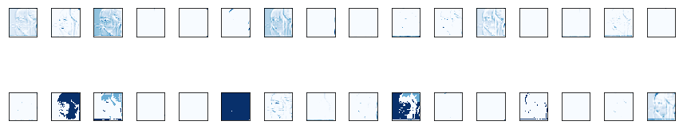


```python
plot_interlayer_outputs(input_img, 0, 4, colormaps=True) 
# figsize=(6,6)
# ax = fig.add_subplot(n_filters/8,8,i+1)
```

    (1, 64, 24, 24)


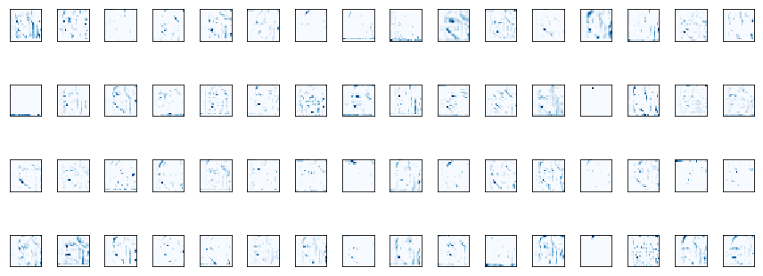


```python
plot_interlayer_outputs(input_img, 0, 10, colormaps=True) 
# figsize=(12,6)
# ax = fig.add_subplot(n_filters/16,16,i+1)
```

    (1, 128, 12, 12)


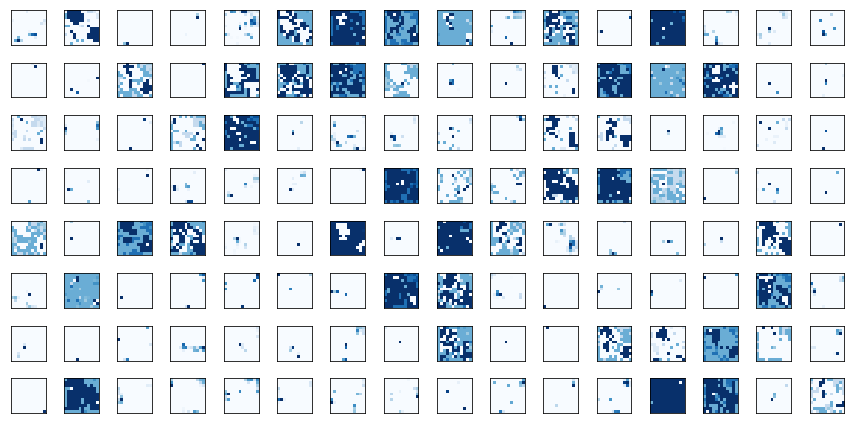


## Prediction Result


```python
# prediction and true labels
y_prob = model.predict(X, batch_size=32, verbose=0)
y_pred = [np.argmax(prob) for prob in y_prob]
y_true = [np.argmax(true) for true in y]
```


```python
def plot_subjects(start, end, y_pred, y_true, title=False):
    fig = plt.figure(figsize=(12,12))
    emotion = {0:'Angry', 1:'Fear', 2:'Happy', 3:'Sad', 4:'Surprise', 5:'Neutral'}
    for i in range(start, end+1):
        input_img = X[i:(i+1),:,:,:]
        ax = fig.add_subplot(6,6,i+1)
        ax.imshow(input_img[0,0,:,:], cmap=matplotlib.cm.gray)
        plt.xticks(np.array([]))
        plt.yticks(np.array([]))
        if y_pred[i] != y_true[i]:
            plt.xlabel(emotion[y_true[i]], color='#53b3cb',fontsize=12)
        else:
            plt.xlabel(emotion[y_true[i]], fontsize=12)
        if title:
            plt.title(emotion[y_pred[i]], color='blue')
        plt.tight_layout()
    plt.show()
```


```python
def plot_probs(start,end, y_prob):
    fig = plt.figure(figsize=(12,12))
    for i in range(start, end+1):
        input_img = X[i:(i+1),:,:,:]
        ax = fig.add_subplot(6,6,i+1)
        ax.bar(np.arange(0,6), y_prob[i], color=set3,alpha=0.5)
        ax.set_xticks(np.arange(0.5,6.5,1))
        labels = ['angry', 'fear', 'happy', 'sad', 'surprise','neutral']
        ax.set_xticklabels(labels, rotation=90, fontsize=10)
        ax.set_yticks(np.arange(0.0,1.1,0.5))
        plt.tight_layout()
    plt.show()
```


```python
def plot_subjects_with_probs(start, end, y_prob):
    iter = (end - start)/6
    for i in np.arange(0,iter):
        plot_subjects(i*6,(i+1)*6-1, y_pred, y_true, title=False)
        plot_probs(i*6,(i+1)*6-1, y_prob)
```


```python
plot_subjects_with_probs(0, 36, y_prob)
```


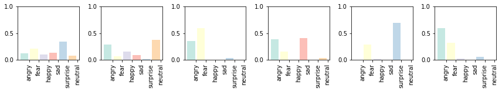


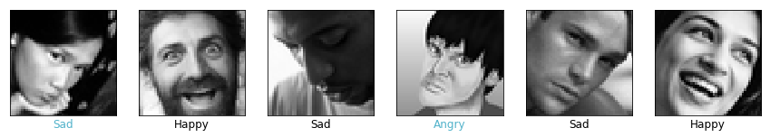


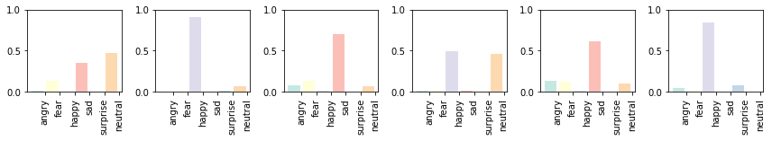


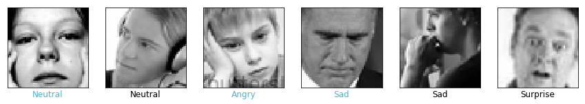


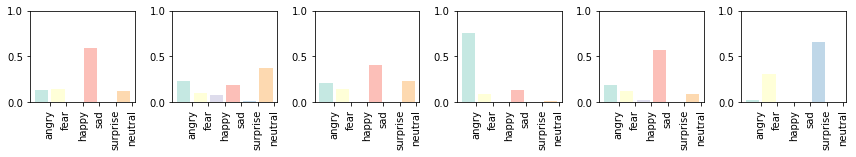


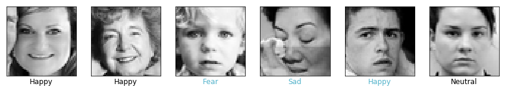


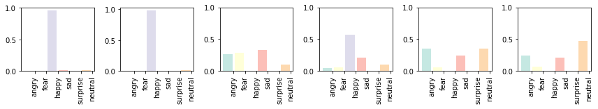


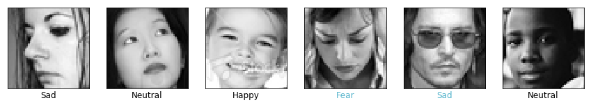


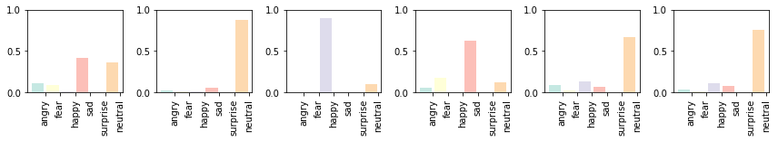


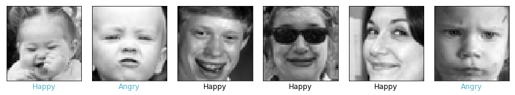


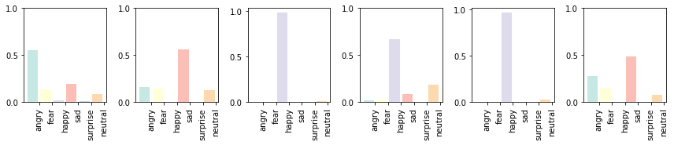


```python
#y_fname1 = 'data/y_publictest6_100pct.npy'
#y_fname3 = 'data/y_privatetest6_100pct.npy'
#y_fname2 = 'data/y_train6.npy'

y_fname1 = 'data/y_train_publictest6_100pct.npy'
y_fname3 = 'data/y_train_privatetest6_100pct.npy'
y_fname2 = 'data/y_train_md.npy'
y_train = np.load(y_fname2) # train

y_public = np.load(y_fname1) # public
y_private = np.load(y_fname3) # private
y_train_labels  = [np.argmax(lst) for lst in y_train]
y_public_labels = [np.argmax(lst) for lst in y_public]
y_private_labels = [np.argmax(lst) for lst in y_private]
```


```python
def plot_distribution(y1, y2, data_names, ylims =[1000,1000]): 
    fig = plt.figure(figsize=(8,4))
    ax1 = fig.add_subplot(1,2,1)
    ax1.bar(np.arange(1,7), np.bincount(y1), color=set3, alpha=0.8)
    ax1.set_xticks(np.arange(1.25,7.25,1))
    ax1.set_xticklabels(labels, rotation=60, fontsize=14)
    ax1.set_xlim([0, 8])
    ax1.set_ylim([0, ylims[0]])
    ax1.set_title(data_names[0])
    ax2 = fig.add_subplot(1,2,2)
    ax2.bar(np.arange(1,7), np.bincount(y2), color=set3, alpha=0.8)
    ax2.set_xticks(np.arange(1.25,7.24,1))
    ax2.set_xticklabels(labels, rotation=60, fontsize=14)
    ax2.set_xlim([0, 8])
    ax2.set_ylim([0, ylims[1]])
    ax2.set_title(data_names[1])
    plt.tight_layout()
    plt.show()
    
plot_distribution(y_train_labels, y_public_labels, \
                  ['Train dataset', 'Public dataset'], \
                  ylims =[8000,1000]) 
plot_distribution(y_train_labels, y_private_labels, \
                  ['Train dataset', 'Private dataset'], \
                  ylims =[8000,1000]) 
```


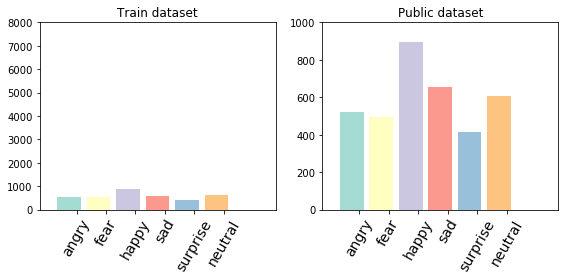


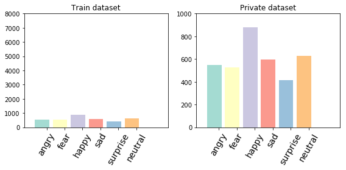


```python
def plot_distribution(y_true, y_pred):
    ind = np.arange(1.5,7,1)  # the x locations for the groups
    width = 0.35   
    fig, ax = plt.subplots()
    true = ax.bar(ind, np.bincount(y_true), width, color=set3, alpha=1.0)
    pred = ax.bar(ind + width, np.bincount(y_pred), width, color=set3, alpha=0.3)
    ax.set_xticks(np.arange(1.5,7,1))
    ax.set_xticklabels(labels, rotation=30, fontsize=14)
    ax.set_xlim([1.25, 7.5])
    ax.set_ylim([0, 1000])
    ax.set_title('True and Predicted Label Count (Private)')
    plt.tight_layout()
    plt.show()
    
plot_distribution(y_true, y_pred)
```


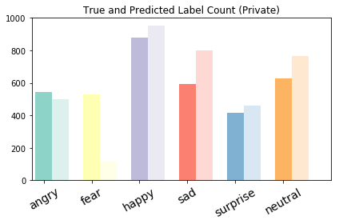


## Confusion Matrix


```python
from sklearn.metrics import confusion_matrix

def plot_confusion_matrix(y_true, y_pred, cmap=plt.cm.Blues):
    cm = confusion_matrix(y_true, y_pred)
    fig = plt.figure(figsize=(6,6))
    matplotlib.rcParams.update({'font.size': 16})
    ax  = fig.add_subplot(111)
    matrix = ax.imshow(cm, interpolation='nearest', cmap=cmap)
    fig.colorbar(matrix) 
    for i in range(0,6):
        for j in range(0,6):  
            ax.text(j,i,cm[i,j],va='center', ha='center')
    # ax.set_title('Confusion Matrix')
    ticks = np.arange(len(labels))
    ax.set_xticks(ticks)
    ax.set_xticklabels(labels, rotation=45)
    ax.set_yticks(ticks)
    ax.set_yticklabels(labels)
    plt.tight_layout()
    plt.ylabel('True label')
    plt.xlabel('Predicted label')
```


```python
plot_confusion_matrix(y_true, y_pred, cmap=plt.cm.YlGnBu)
```


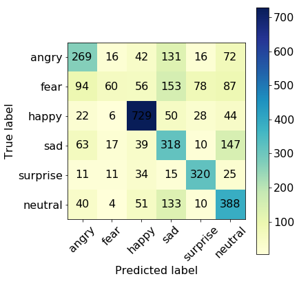


## Classification Metrics


```python
def class_precision(y_true, y_pred, emotion):
    cm = confusion_matrix(y_true, y_pred)
    i = [i for i, label in enumerate(labels) if label == emotion][0]
    col = [cm[j,i] for j in range(0,6)]
    return float(col[i])/sum(col)

def class_recall(y_true, y_pred, emotion):
    cm = confusion_matrix(y_true, y_pred)
    i = [i for i, label in enumerate(labels) if label == emotion][0]
    row = [cm[i,j] for j in range(0,6)]
    return float(row[i])/sum(row)

def class_accuracy(y_true, y_pred, emotion):
    cm = confusion_matrix(y_true, y_pred)
    i = [i for i, label in enumerate(labels) if label == emotion][0]
    tp = cm[i,i]
    fn = sum([cm[i,j] for j in range(0,6) if j != i])
    fp = sum([cm[j,i] for j in range(0,6) if j != i])
    tn = sum([cm[i,j] for j in range(0,6) for i in range(0,6)]) -(tp+fp+fn)
    return float(tp + tn)/sum([tp, fn, fp, tn])
```


```python
# private test set
for emotion in labels:
    print emotion.upper()
    print '   acc = {}'.format(class_accuracy(y_true, y_pred, emotion))
    print '  prec = {}'.format(class_precision(y_true, y_pred, emotion))
    print 'recall = {}\n'.format(class_recall(y_true, y_pred, emotion))
```

    ANGRY
       acc = 0.858735023683
      prec = 0.539078156313
    recall = 0.492673992674
    
    FEAR
       acc = 0.854555586514
      prec = 0.526315789474
    recall = 0.113636363636
    
    HAPPY
       acc = 0.896349958206
      prec = 0.766561514196
    recall = 0.829351535836
    
    SAD
       acc = 0.788799108387
      prec = 0.3975
    recall = 0.535353535354
    
    SURPRISE
       acc = 0.933686263583
      prec = 0.692640692641
    recall = 0.769230769231
    
    NEUTRAL
       acc = 0.829200334355
      prec = 0.508519003932
    recall = 0.619808306709
    


```python
from sklearn.metrics import classification_report
print classification_report(y_true, y_pred, target_names=labels)
```

                 precision    recall  f1-score   support
    
          angry       0.54      0.49      0.51       546
           fear       0.53      0.11      0.19       528
          happy       0.77      0.83      0.80       879
            sad       0.40      0.54      0.46       594
       surprise       0.69      0.77      0.73       416
        neutral       0.51      0.62      0.56       626
    
    avg / total       0.58      0.58      0.56      3589
    


```python
n = len(y_true)
y_fir = []
y_sec = []
y_trd = []
for i in range(n):
    if y_true[i] == np.argsort(y_prob[i])[-1]:
        y_fir.append([i, y_true[i]])
    if y_true[i] == np.argsort(y_prob[i])[-2]:
        y_sec.append([i, y_true[i]])
    if y_true[i] == np.argsort(y_prob[i])[-3]:
        y_trd.append([i, y_true[i]])
print float(len(y_fir))/n
print float(len(y_sec))/n
print float(len(y_trd))/n
```

    0.580663137364
    0.183895235442
    0.111173028699


```python
misclass = [float(len(y_fir))/n, float(len(y_sec))/n, float(len(y_trd))/n]
```


```python
len(y_sec)/(len(y_true)*0.58)
```


    0.3170607507614262


```python
len(y_true)*0.58
```


    2081.62


```python
plt.hist([pair[1] for pair in y_sec])
```


    (array([ 110.,    0.,  161.,    0.,   67.,    0.,  142.,    0.,   35.,  145.]),
     array([ 0. ,  0.5,  1. ,  1.5,  2. ,  2.5,  3. ,  3.5,  4. ,  4.5,  5. ]),
     <a list of 10 Patch objects>)


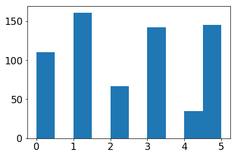


```python
from sklearn.metrics import hamming_loss
hamming_loss(y_true, y_pred)
```


    0.4193368626358317


```python
def plot_misclass_distribution(y, tags): 
    fig = plt.figure(figsize=(4,4))
    ax1 = fig.add_subplot(1,1,1)
    ax1.bar(np.arange(1,len(y)+1), np.array(y)*100, color=set3, alpha=0.8)
    ax1.set_xticks(np.arange(1.40,len(y)+1.40,1))
    ax1.set_xticklabels(tags, rotation=0, fontsize=14)
    ax1.set_xlim([0.75, len(y)+1])
    ax1.set_ylim([0,100])
    ax1.grid(True)
    ax1.set_title('')
    plt.tight_layout()
    plt.show()
tags = ['True\n positive','Correct\n on 2st','Correct\n on 3rd']
plot_misclass_distribution(misclass, tags)
```


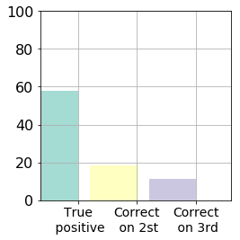


```python

```
